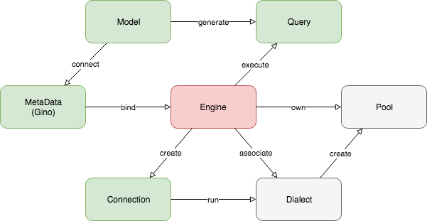
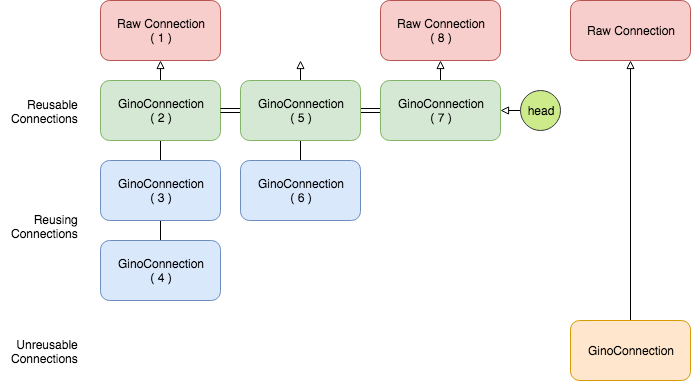

=====================
Engine and Connection
=====================

:class:`~gino.engine.GinoEngine` is the core of GINO. It acts like a pool of
connections but also does the work of assembling everyone together:

Under the hood, engine is associated with a specific dialect instance on
creation, e.g. asyncpg dialect. The dialect is actually a set of classes that
implements GINO dialect API, offering all the details about how to operate on
this specific database. In the diagram, gray color means internal, while green
means touchable by end users.

During creation, the engine will also ask the dialect to create a database
connection pool for it. The pool type is also a part of the dialect API,
because asynchronous database drivers usually have their own pool
implementation, thus their GINO dialects should hide such implementation
differences behind the unified diagram API for engine to use.

.. note::

    In SQLAlchemy, database drivers are supposed to follow the DB-API standard,
    which does not usually provide a pool implementation. Therefore, SQLAlchemy
    has its own pool implementation, created directly in engine. This is where
    this diagram doesn't fit SQLAlchemy.

The pool creates raw connections, not the :class:`~gino.engine.GinoConnection`
green in the diagram. The connection in the diagram is a many-to-one wrapper of
the raw connection, because of the reuse and lazy features, we'll get to that
part later. The connection is created by the engine, thus inherits the same
dialect, and is used for running queries.

On the outer side, SQLAlchemy queries can be executed directly on the engine or
connection. When on engine, it will try to acquire a reusable connection to
actually execute the connection, and release the connection after use.

.. note::

    Another difference to SQLAlchemy here: GINO execution methods always return
    final results, while in SQLAlchemy accessing the result may cause further
    implicit database accesses. Therefore GINO engine immediately releases the
    connection when the execution method on the engine returns, but SQLAlchemy
    can only release the connection implicitly when the result data is found
    exhausted.

    By immediately releasing a connection, GINO may not release the related raw
    connection when the raw connection was reused from another parent
    connection. We'll get to this later.

GINO also supports `implicit execution
<https://docs.sqlalchemy.org/en/latest/core/connections.html#connectionless-execution-implicit-execution>`_
without having to specify an engine or connection explicitly. This is done by
binding the engine to the ``db`` instance, also known as the
:class:`~sqlalchemy.schema.MetaData` or the :class:`~gino.api.Gino` instance.
You may possibly bind a :class:`~gino.engine.GinoConnection` instance, but that
is greatly not recommended because it is very much untested.

At last, as the ORM / CRUD feature, models are just add-ons on top of
everything else to generate queries. The parent model class is connected to a
``db`` instance on creation, therefore the models can do implicit execution too
if their ``db`` has a bind.

Then let's get to some details.

Creating Engines
----------------

GINO reuses the strategy system SQLAlchemy provides to create engines. The name
of GINO's strategy to create asynchronous :class:`~gino.engine.GinoEngine` is
just ``gino``, but only available after ``gino`` is imported::

    import gino, sqlalchemy

    async def main():
        e = await sqlalchemy.create_engine('postgresql://...', strategy='gino')
        # e is a GinoEngine

.. tip::

    Please read `this SQLAlchemy document
    <https://docs.sqlalchemy.org/en/latest/core/engines.html#database-urls>`_
    to learn about writing database URLs.

Also the GINO strategy replaces the default driver of dialect ``postgresql://``
from ``psycopg2`` to ``asyncpg``, so that you don't have to replace the URL
as it may be shared between GINO and vanilla SQLAlchemy in parallel.
Alternatively, you can explicitly specify the driver to use by
``postgresql+asyncpg://...`` or just ``asyncpg://...``.

GINO also offers a shortcut as :func:`gino.create_engine`, which only sets the
default strategy to ``gino`` and does nothing more. So here is an identical
example::

    import gino

    async def main():
        e = await gino.create_engine('postgresql://...')
        # e is also a GinoEngine

As you may have noticed, when using the GINO strategy,
:func:`~sqlalchemy.create_engine` returns a coroutine, which must be awaited
for result. Because it will create a database connection pool behind the scene,
and actually making a few initial connections by default.

For it is just SQLAlchemy :func:`~sqlalchemy.create_engine`, the same rules of
parameters apply in GINO too. Well for now, GINO only supports a small amount
of all the parameters listed in SQLAlchemy document (we are working on it!):

For Dialect:

* `isolation_level <https://docs.sqlalchemy.org/en/latest/core/engines.html#sqlalchemy.create_engine.params.isolation_level>`_
* `paramstyle <https://docs.sqlalchemy.org/en/latest/core/engines.html#sqlalchemy.create_engine.params.paramstyle>`_

For Engine:

* `echo <https://docs.sqlalchemy.org/en/latest/core/engines.html#sqlalchemy.create_engine.params.echo>`_
* `execution_options <https://docs.sqlalchemy.org/en/latest/core/engines.html#sqlalchemy.create_engine.params.execution_options>`_
* `logging_name <https://docs.sqlalchemy.org/en/latest/core/engines.html#sqlalchemy.create_engine.params.logging_name>`_

While these parameters are discarded by GINO:

* `module <https://docs.sqlalchemy.org/en/latest/core/engines.html#sqlalchemy.create_engine.params.module>`_

In addition, keyword arguments for creating the underlying pool is accepted
here. In the case of asyncpg, they are from :func:`~asyncpg.pool.create_pool`.
For example, we can create an engine without initial connections::

    e = await gino.create_engine('postgresql://...', min_size=0)

Similar to SQLAlchemy, GINO also provides shortcut to create engine while
setting it as a bind. In SQLAlchemy it is like this::

    import sqlalchemy

    metadata = sqlalchemy.MetaData()
    metadata.bind = 'postgresql://...'

    # or in short

    metadata = sqlalchemy.MetaData('postgresql://...')

This implicitly calls :func:`~sqlalchemy.create_engine` under the hood. However
in GINO, creating an engine requires ``await``, it can no longer be hidden
behind a normal assignment statement. Therefore, GINO removed the assignment
magic in subclass :class:`~gino.api.Gino`, reverted it to simple assignment::

    import gino

    db = gino.Gino()

    async def main():
        # db.bind = 'postgresql://...' doesn't work!! It sets a string on bind
        engine = await gino.create_engine('postgresql://...')
        db.bind = engine

And provided a shortcut to do so::

    engine = await db.set_bind('postgresql://...')

And another simpler shortcut for one-time usage::

    db = await gino.Gino('postgresql://...')

To unset a bind and close the engine::

    engine, db.bind = db.bind, None
    await engine.close()

Or with a shortcut correspondingly::

    await engine.pop_bind().close()

Furthermore, the two steps can be combined into one shortcut with asynchronous
context manager::

    async with db.with_bind('postgresql://...') as engine:
        # your code here

Managing Connections
--------------------

With a :class:`~gino.engine.GinoEngine` at hand, you can acquire connections
from the pool now::

    conn = await engine.acquire()

Don't forget to release it after use::

    await conn.release()

Yes this can be easily missing. The recommended way is to use the asynchronous
context manager::

    async with engine.acquire() as conn:
        # play with the connection

Here ``conn`` is a :class:`~gino.engine.GinoConnection` instance. As mentioned
previously, :class:`~gino.engine.GinoConnection` is mapped to an underlying raw
connection, as shown in following diagram:

Each column has at most one actual raw connection, and the number is the
sequence the connections are created in this example. It is designed this way
so that GINO could offer two features for connection management: ``reuse`` and
``lazy``. They are keyword arguments on :meth:`~gino.engine.GinoEngine.acquire`
and by default switched off.

reuse
"""""

When acquiring a :class:`~gino.engine.GinoConnection` (2), GINO will borrow a
raw connection (1) from the underlying pool first, and assign it to this
:class:`~gino.engine.GinoConnection` (2). This is the default behavior of
:meth:`~gino.engine.GinoConnection.acquire` with no arguments given. Even when
you are nesting two acquires, you still get two actual raw connection
borrowed::

    async with engine.acquire() as conn1:
        async with engine.acquire() as conn2:
            # conn2 is a completely different connection than conn1

But sometimes ``conn2`` may exist in a different method::

    async def outer():
        async with engine.acquire() as conn1:
            await inner()

    async def inner():
        async with engine.acquire() as conn2:
            # ...

And we probably wish ``inner`` could reuse the same raw connection in
``outer`` to save some resource, or borrow a new one if ``inner`` is
individually called without ``outer``::

    async def outer():
        async with engine.acquire() as conn1:
            await inner(conn1)

    async def inner(conn2=None):
        if conn2 is None:
            async with engine.acquire() as conn2:
                # ...
        else:
            # the same ... again

This is exactly the scenario ``reuse`` could be useful. We can simply tell the
:meth:`~gino.engine.GinoConnection.acquire` to reuse the most recent reusable
connection in current context by setting ``reuse=True``, as presented in this
identical example::

    async def outer():
        async with engine.acquire() as conn1:
            await inner(conn1)

    async def inner():
        async with engine.acquire(reuse=True) as conn2:
            # ...

Back to previous diagram, the blue :class:`~gino.engine.GinoConnection`
instances (3, 4, 6) are "reusing connections" acquired with ``reuse=True``,
while the green ones (2, 5, 7) are not, thus they become "reusable
connections". The green reusable connections are put in a stack in current
context, so that ``acquire(reuse=True)`` always reuses the most recent
connection at the top of the stack. For example, (3) and (4) reuse the only
available (2) at that moment, therefore (2, 3, 4) all map to the same raw
connection (1). Then after (5), (6) no longer reuses (2) because (5) is now the
new head of the stack.

.. tip::

    By context, we are actually referring to the context concept in
    `contextvars <https://docs.python.org/3.7/library/contextvars.html>`_ the
    new module in Python 3.7, and its partial backport `aiocontextvars
    <https://github.com/fantix/aiocontextvars>`_. Simply speaking, you may
    treat a series of function calls in a chain as in the same context, even if
    there is an ``await``. It's something like a thread local in asyncio.

:class:`~gino.engine.GinoConnection` (2) may be created through
``acquire(reuse=True)`` too - because the stack is empty before (2), there is
nothing to reuse, so (2) upgraded itself to a reusable connection.

Releasing a reusing connection won't cause the reused raw connection being
returned to the pool, only directly releasing the reused
:class:`~gino.engine.GinoConnection` can do so. Connections should be released
in the reversed order as they are acquired, but if the reused connection is
released before reusing connections by accident, then all the reusing
connections depending on it will turn closed because they are reusing the same
raw connection which is returned to the pool, any further execution will fail.
For example, if (3) is released first, then (2) and (4) are still functional.
But if (2) is released first, then (3) and (4) will be released implicitly and
are no longer usable any more.

lazy
""""

As you may have found, :class:`~gino.engine.GinoConnection` (5) does not have
an underlying raw connection, even when it is reused by (6). This is because
both (5) and (6) set ``lazy=True`` on acquire.

A lazy connection will not borrow a raw connection on creation, it will only do
so when have to, e.g. when executing a query or starting a transaction. For
example, :class:`~gino.engine.GinoConnection` (7) is acquired lazily without a
raw connection, and (8) is only created when a query is executed on (7)::

    async with engine.acquire(lazy=True) as conn:  # (7)
        await conn.scalar('select now()')          # (8)

On implementation level, ``lazy`` is extremely easy in
:meth:`~gino.engine.GinoEngine.acquire`: if ``lazy=False`` then borrow a raw
connection, else do nothing. That's it. Before executing a query or starting a
transaction, :class:`~gino.egnine.GinoConnection` will always try to borrow a
raw connection if there is none present. This allows GINO to "transiently
release" a raw connection, while all :class:`~gino.engine.GinoConnection`
mapped to this raw connection are put in lazy mode (again). This is especially
useful before you need to run some networking tasks in a database-related
context - the networking task may take a long time to finish, we don't want to
waste a connection resource checked out for nothing. For example::

    async with engine.acquire(lazy=True) as conn:  # (7)
        await conn.scalar('select now()')          # (8)
        await conn.release(permanent=False)        # release (8)
        await asyncio.sleep(10)                    # simulate long I/O work
        await conn.scalar('select now()')          # re-acquire a new raw connection,
                                                   #   not necessarily the same (8)

When used together with ``reuse``, at most one raw connection may be borrowed
for one reusing chain. For example, executing queries on both (5) and (6) will
result only one raw connection checked out, no matter which executes first. It
is also worth noting that, if we set ``lazy=False`` on (6), then the raw
connection will be immediately borrowed on acquire, and shared between both (5)
and (6). It's been quite a while, let me post the same diagram again:

reusable
""""""""

Usually, you don't have to worry about the two options ``reuse`` and ``lazy``,
using the default :meth:`~gino.engine.GinoEngine.acquire` will always create
a concrete :class:`~gino.engine.GinoConnection` with a new raw connection with
it. It is only that they are by default reusable (the green ones). If you need
an absolutely isolated unique connection that has no risk being reused, you may
use ``reusable=False`` on acquire. As shown in the diagram, the unreusable
:class:`~gino.engine.GinoConnection` is an orphan away from any stack::

    async with engine.acquire():                    # (2)
        async with engine.acquire(reusable=False):  # the unreusable connection
            async with engine.acquire(reuse=True):  # (3)

Unreusable connections can be lazy. But it is usually meaningless to specify
both ``reuse=True`` and ``reusable=False`` at the same time, because reusing
connections are always unusable - they are also not in the stack. You cannot
reuse a reusing connection, you only reuse a reusable connection in the stack.
Making a reusing connection unreusable doesn't make its related reusable
connection unreusable. Hmm if this is getting more confusing, just don't use
``acquire(reuse=True, reusable=False)`` unless you know what it does.

current_connection
""""""""""""""""""

Except for all scenarios supported by above three options, there is still one
left out: we may want to acquire a reusing-only connection. There is no such
option to do so, but GINO could do the same thing through
:attr:`~gino.engine.GinoEngine.current_connection` which is always the reusable
:class:`~gino.engine.GinoConnection` at the top of current stack, or ``None``
if current stack is empty.

.. tip::

    The different between :attr:`~gino.engine.GinoEngine.current_connection`
    and :meth:`acquire(reuse=True) <gino.engine.GinoEngine.acquire>` is, the
    latter always produces a :class:`~gino.engine.GinoConnection`, while the
    former may not.

Executing Queries
-----------------

Once you have a :class:`~gino.engine.GinoConnection` instance, you can start
executing queries with it. There are 4 variants of the execute method:
:meth:`~gino.engine.GinoConnection.all`,
:meth:`~gino.engine.GinoConnection.first`,
:meth:`~gino.engine.GinoConnection.scalar` and
:meth:`~gino.engine.GinoConnection.status`. They are basically the same:
accepting the same parameters, calling the same underlying methods. The
difference is how they treat the results:

* :meth:`~gino.engine.GinoConnection.all` returns all results in a
  :class:`list`, which may be empty when the query has no result, empty but
  still a :class:`list`.
* :meth:`~gino.engine.GinoConnection.first` returns the first result directly,
  or ``None`` if there is no result at all. There is usually some optimization
  behind the scene to efficiently get only the first result, instead of loading
  the full result set into memory.
* :meth:`~gino.engine.GinoConnection.scalar` is similar to
  :meth:`~gino.engine.GinoConnection.first`, it returns the first value of the
  first result. Quite convenient to just retrieve a scalar value from database,
  like ``NOW()``, ``MAX()``, ``COUNT()`` or whatever generates a single value.
  ``None`` is also returned when there is no result, it is up to you how to
  distinguish no result and the first value is ``NULL``.
* :meth:`~gino.engine.GinoConnection.status` executes the query and discard all
  the query results at all. Instead it returns the execution status line as it
  is, usually a textual string. Note, there may be no optimization to only
  return the status without loading the results, so make your query generate
  nothing if you don't want any result.

By "result", I meant :class:`~sqlalchemy.engine.RowProxy` of SQLAlchemy - an
immutable row instance with both :class:`tuple` and :class:`dict` interfaces.
Database values are translated twice before they are eventually stored in a
:class:`~sqlalchemy.engine.RowProxy`: first by the database driver (dialect)
from network payload to Python objects (see `Type Conversion
<https://magicstack.github.io/asyncpg/current/usage.html#type-conversion>`_ of
how asyncpg does this), second by SQLAlchemy
:meth:`~sqlalchemy.types.TypeEngine.result_processor` depending on the actual
type and dialect.

The arguments taken by these 4 methods are identical to the ones accepted by
SQLAlchemy :meth:`~sqlalchemy.engine.Connection.execute` (click to read more),
usually a plain string of SQL directly or a SQLAlchemy query clause, followed
by query parameters. In the case when multiple dictionaries are given to
``multiparams``, all 4 methods will always return ``None`` discarding all
results. Likewise, the parameter values are processed twice too: first by
:meth:`~sqlalchemy.types.TypeEngine.bind_processor` then the database driver.

GINO also supports SQLAlchemy
:meth:`~sqlalchemy.engine.Connection.execution_options` provided either on
:meth:`engine level <gino.engine.GinoEngine.update_execution_options>`,
:meth:`connection level <gino.engine.GinoConnection.execution_options>` or on
:meth:`queries <sqlalchemy.sql.expression.Executable.execution_options>`. At
the moment we are working on being compatible with SQLAlchemy execution
options. In the mean while, GINO provides several new execution options, for
example enabling ``return_model`` and providing a ``model`` will make
:meth:`~gino.engine.GinoConnection.all` and
:meth:`~gino.engine.GinoConnection.first` return ORM model instance(s) instead
of :class:`~sqlalchemy.engine.RowProxy` instance(s). See also
:meth:`~sqlalchemy.engine.Connection.execution_options` for more information.

In addition, GINO has an :meth:`~gino.engine.GinoConnection.iterate` method to
traverse the query results progressively, instead of loading all the results at
once. This method takes the same arguments as the other 4 execute methods do,
and follows the same rule of data handling. For now with asyncpg, this creates
a `server-side cursor
<https://magicstack.github.io/asyncpg/current/api/index.html#cursors>`_.

Implicit Execution
------------------

Acquire a :class:`~gino.engine.GinoConnection` and execute queries on it, that
is the most explicit way. You can also execute queries on a
:class:`~gino.engine.GinoEngine` instance. In this case, a connection will be
acquired with ``reuse=True`` for you implicitly, and released after returning::

    await engine.scalar('select now()')

Equals to::

    async with engine.acquire(reuse=True) as conn:
        await conn.scalar('select now()')

This allows you to easily write connectionless code. For example::

    async def get_now():
        return await engine.scalar('select now()')

    async def main():
        async with engine.acquire():
            now = await get_now()
            await engine.status('UPDATE ...')

In this example, ``main()`` will take only one raw connection. ``get_now()``
can also work alone out of any ``acquire()`` context, thanks to ``reuse``.

Furthermore, GINO provides the same query APIs on :class:`~gino.api.Gino`
directly. They are simply delegates to corresponding API methods on the
``bind``. This allows even engine-less programming::

    db = gino.Gino()

    async def get_now():
        return await db.scalar('select now()')

    async def main():
        async with db.with_bind('postgresql://...'):
            now = await get_now()
            await db.status('UPDATE ...')

.. note::

    In this example we didn't put the two queries in an ``acquire()`` block, so
    they might be executed in two different connections.

At last, the SQLAlchemy `implicit execution
<https://docs.sqlalchemy.org/en/latest/core/connections.html#connectionless-execution-implicit-execution>`_
on queries also work in GINO, under an extension named ``gino``::

    await users_table.select().gino.all()

By default, the extension :class:`~gino.api.GinoExecutor` is injected on
:class:`~sqlalchemy.sql.expression.Executable` as a property of name ``gino``
at the creation of :class:`~gino.api.Gino` instance. Therefore, any
:class:`~sqlalchemy.sql.expression.Executable` object has the ``gino``
property for implicit execution. Similarly, the execution methods calls the
corresponding ones on the ``bind`` of the ``db`` instance.
