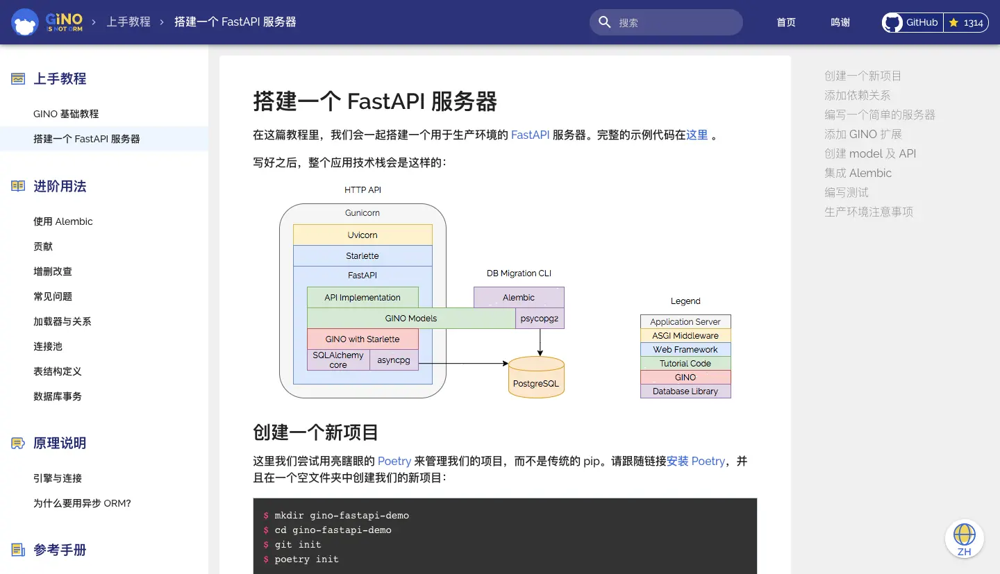

官宣：Python 异步编程再添一利器
=========================

   GINO 填补了国内外 asyncio ORM 领域的空白

随着 Tornado\ [1]_ 和 asyncio\ [2]_ 等框架的陆续涌现，Python 异步编程这个话题也在逐渐升温。\
在这个烧脑的异步世界里，有没有办法可以既方便快捷、又简单明了地访问数据库呢？GitHub 千星项目
`GINO <https://github.com/python-gino/gino>`__ 了解一下！

GINO 是谁
---------

GINO 是一个“轻量级”异步 ORM 框架，它的全称是 GINO Is Not ORM，借鉴了 GNU is Not Unix
的递归定义\ [3]_\ 手法。所以，GINO 一定要全！部！大！写！如果像这样“Gino”就变成了人名，\
你肯定要问一句“这是谁”。

ORM，即关系对象映射（Object-Relational Mapping\ [4]_\ ），是一类开发人员喜闻乐见的效率工具，\
它们“极大地”提升了写代码的幸福指数。GINO 是用来访问数据库的，也提供了对象映射的工具，那为什么非说
GINO 不是 ORM 呢？

因为物极必反，ORM 在带来生活便利的同时，也是 bug 生长的温床——传统 ORM 往往会选择牺牲明确性\
（explicitness）来换取便捷性（convenience），再加上 Python 得天独厚的灵活性（flexibility），\
创造出了一种爆炸式的化学反应。一旦代码初具规模，项目或多或少都会遇到 ORM 反噬的情景：\
性能莫名其妙的差、出问题找不到原因、为了鸡毛蒜皮的小事大动干戈。随便一句 ``current_user.name``
都有可能触发一大堆意想不到的数据库调用，这代码你让我怎么调试？

传统 ORM 的学习曲线前平后陡，能在快速原型开发中大展身手，\
但应用到大型项目中却十分考验开发人员的平均水平。

所有这些问题如果再放进异步编程的环境里，那就是 O(n\ :sup:`2`) 的复杂度了——哦不，是
O(2\ :sup:`n`)。这对于一款优秀的异步 ORM 框架来说是不可接受的，所以 GINO 是 ORM 但不是一个传统的
ORM，正犹如 GNU 不是一个传统的 Unix 一样，形似而神不似。

所以在 2017 年创作之初，我就给 GINO 定下了两个业绩目标：1) 方便快捷，2) 简单明了。三年后的今天，\
我索性在 1.0 稳定版发布的前夕做个年终总结。

先说“方便快捷”
-------------

   “方便快捷”主要说的是开发效率。

重视开发效率的概念对于写 Python 的同学来说可能并不陌生，某些场景下，\
开发人员的时间确实比机器的时间值钱。所以，传统 ORM 里的对象映射不能丢。

::

    from gino import Gino
    db = Gino()
    class User(db.Model):
        __tablename__ = "users"
        id = db.Column(db.Integer, primary_key=True)
        name = db.Column(db.String)

这么定义表结构甚至让人有点小兴奋。咦，为什么这么眼熟？

没有错，这就是 SQLAlchemy ORM\ [5]_ 的定义风格。GINO 并不是从头造轮子，而是在 SQLAlchemy
core\ [6]_\ （SQLAlchemy 中负责构建 SQL 的底层核心）的基础上开发的。这么做除了能保持熟悉的味道\
（以节省学习和迁移成本），更重要的是带来了整个 SQLAlchemy 的生态环境：开箱即用的数据库变更管理工具
Alembic\ [7]_\ 、各种 SQLAlchemy 的增强插件\ [8]_\ 、专业领域的 PostGIS/geoalchemy\ [9]_\
等，GINO 全都兼容。

是不是十分方便、十分快捷？不止这样。

GINO 一站式地解决了常用 CRUD 快捷方式\ [10]_\ 、上下文管理（aiocontextvars\ [11]_\ [12]_\ ）、
数据库事务封装和嵌套\ [13]_\ 、连接池管理和懒加载\ [14]_\ 等多项便捷功能，无额外依赖关系，即装即用。

::

   daisy = await User.create(name="daisy")
   await daisy.update(name="Daisy").apply()

GINO 还提供了\ [15]_\ 各大流行异步 Web 框架的定制版插件，能叫上名字的像 Tornado\ [1]_\ 、\
aiohttp\ [16]_\ 、Sanic\ [17]_\ 、FastAPI\ [18]_\ /Starlette\ [19]_\ 、Quart\ [20]_\
什么的都有，从简单示范到生产环境的各种例子品种齐全，妈妈再也不用担心我不会集成 Web 框架了。

为了让不同应用场景下的用户体验到最大的善意，GINO 目前支持三种不同程度的用法，成功实现了对同期竞品
asyncpgsa\ [21]_ 的降维打击：

1. 最少侵入型\ [22]_\ ：SQLAlchemy core 原教旨主义者，只有异步执行时才用到 GINO。
2. 终身不婚型\ [23]_\ ：天生厌恶“对象”，只愿定义“表”，空手接 SQL。
3. 火力全开型\ [24]_\ ：最大程度的便利，非典型异步 ORM。

最后，虽然是 Python（绝不是黑哈），但 GINO 在执行效率上也没落下。基于 MagicStack 出品必属精品的、\
一秒可读百万行的 asyncpg\ [25]_\ ，以及 uvloop\ [26]_\ （可选）的强力加持，GINO
跑起来也是可以飞快的，被广泛应用于诸如实时汇率、聊天机器人、在线游戏等高并发领域，\
深受俄罗斯和乌克兰人民的爱戴。

再说“简单明了”
-------------

   Explicit is better than implicit.

   Simple is better than complex.

   –The Zen of Python, PEP 20\ [27]_

Python 之禅完美表达了 GINO 的立场——明确性（explicitness）对于上了规模的异步工程项目来说尤为重要，\
因此 GINO 的很多设计都受到了明确性的影响。

比如说，GINO 的 ``Model`` 是完全无状态的普通 Python 对象（POPO\ [28]_\ —— 例如前面的 ``User``
类，它的实例 ``daisy`` 就是内存里面的常规对象，你可以用 ``daisy.name`` 访问属性，也可以用
``daisy.name = "DAISY"`` 来修改属性，或者用 ``u = User()`` 来创建新的实例，\
这些操作都不会访问数据库，绝对绿色环保无毒副作用。

等到需要操作数据库的时候，你一定会有感知的。比如执行 ``INSERT`` 要用
``u = await User.create()``\ ，而 ``UPDATE`` 则是
``await u.update(name="Daisy").apply()``\ 。

.. hint::

   其中，``u.update(name="Daisy")`` 与 ``u.name = "Daisy"`` 类似，\
   都是只在内存里修改对象的属性，不同的是 ``u.update()`` 还会返回一个包含本次变更的中间结果，\
   对其执行 ``await xxx.apply()`` 则会将这些变更应用到数据库里。

这里的 ``await`` 就是明确性的关键，意味着我们要跳出去执行数据库操作了。换句话说，没有 ``await``
就没有数据库操作。

另一方面，对于如何将数据库查询结果组装成内存对象及其属性，GINO
也有一套精妙的显式机制——可定制化的加载器 loaders\ [29]_\ 。对于简单直观的一对一加载，GINO
自然是伺候到家的，比如用 ``u = await User.get(1)`` 可以直接获取到 ID 为 ``1`` 的用户对象。\
但是对于更复杂的查询，GINO 不会去无端猜测主人的意图，而全权交给用户来明确地定义。\
加载器的用法也是很简单的，比如一个用户可能写了很多本书：

::

    class Book(db.Model):
        __tablename__ = "books"
        id = db.Column(db.Integer, primary_key=True)
        title = db.Column(db.String)
        author_id = db.ForeignKey("users.id")

然后这样来加载这种多对一关系，以同时获取所有的书和他们的作者：

::

    query = Book.outerjoin(User).select()
    loader = Book.load(author=User)
    async for book in query.gino.load(loader).iterate():
        print(book.title, "written by", book.author.name)

很简单的一个外连接查询 ``Book.outerjoin(User)``\ ，配合一个直观的加载器
``Book.load(author=User)``\ ，就实现了：

1. 执行 ``SELECT * FROM books LEFT JOIN users ON ...``\ ；
2. 将数据库返回结果的每一行中，属于 ``books`` 的字段加载成一个 ``Book`` 实例；
3. 然后将该行中剩下的属于 ``users`` 的字段加载成一个 ``User`` 实例；
4. 最后将 ``User`` 实例设置到 ``Book`` 实例的 ``author`` 属性上。

既简单又明了有没有！你甚至可以手写任何 SQL，然后定制加载器自动加载成期望的对象关系，\
精准控制加载行为，指哪儿打哪儿。GINO 还有很多类似的特性，在这里就不一一列举了。

优势与不足
---------

随着这几年 GINO 不断演进成熟，Python 开源社区里也相继出现了像 Tortoise
ORM\ [30]_\ 、ORM\ [31]_\ （是的，这个项目就叫 ORM……我真 ORZ。出品方是 Encode，Starlette
就是他们的作品）等优秀的异步 ORM 框架。它们关注的重点与 GINO 稍有不同，但都是同行就不多评价了。

GINO 的最大优势还是在于充分平衡了开发效率和明确性之间的辩证矛盾关系，用 GINO 开发应用程序的时候\
不用担心会被意料之外的行为所惊吓到，同时也不需要为这种明确性付出过大的工程代价，上手后依然可以快速、\
快乐地编程。同时，大量的成功案例也证明了 GINO 已经初步具备发布 1.0 稳定版的各种条件，\
可以谨慎地用于生产环境了。

以下是近来统计到的关于 GINO 的应用案例：

-  笔者工作上开发的一个服务：\ https://github.com/uc-cdis/metadata-service
-  还是笔者自己写的一个工具：\ https://github.com/fantix/aintq
-  一个汇率 API 服务：\ https://exchangeratesapi.io/

   .. image:: ../images/exchangeratesapi.webp
      :align: center

-  各种 Telegram、Discord 的 Bot。
-  ArchLinux 用户包：\ https://aur.archlinux.org/packages/python-gino/

   .. image:: ../images/archlinux.webp
      :align: center

-  https://github.com/bryanforbes/gino-stubs/
-  俄语教程：\ https://www.youtube.com/watch?v=WW4rOnfhiQY
-  高性能模板项目：\ https://github.com/leosussan/fastapi-gino-arq-uvicorn
-  还有几个商用的，但没征得同意就不贴出来了。

另外，GINO 还贴心地提供了中文文档\ [32]_\ ，从上手教程到原理说明应有尽有（虽然文档还在努力编写中！）：

GINO 目前的不足之处还有一些，比如没有照顾到 Python 3 的类型提示，因此还不能完全发挥 IDE 的潜能\
（上面那个 gino-stubs 就是有人受不了了自己写了一个类型注解）。MySQL 目前也是不支持的，但 GINO
从比较早就解耦了不同 SQL 方言和驱动的集成，所以这些功能会陆续在 1.1 和 1.2 版本中跟上。

建设社会主义
-----------

GINO 是一个开源项目，所以欢迎大家一起来建设！长期活跃的贡献者还能获赠价值 **4888 元**\ 的 PyCharm
专业版全家桶 License 一枚\ [33]_\ （没有发票）。

目前急需帮助的有：

1. 各个 Web 框架插件的维护工作需要多人认领；
2. 更多的例子和文档，以及中文、俄文的翻译；
3. MySQL 的支持。

以及下面这些一直需要的帮助：

1. 用 GINO，找 bug，提建议；
2. 修 bug，做功能，提 PR；
3. 维护社区，回答问题，参与讨论；
4. 最后也是最重要的：\ `去 GitHub 上给 GINO 加一颗星星！
   <https://github.com/python-gino/gino>`__

关于作者
-------

87 年生人，6 岁开始接触编程，二十五六年的编程史和十三四年的工作经验教会了我许多软件开发的奥义。\
小时候写 GBasic、QBasic 和 Visual Basic；大学里开始写 Java 并接触到了 FreeBSD 和 Ubuntu
等开源项目且一发不可收拾；工作头五年转向了 Python，通过 Twisted 和 Eventlet 等项目了解了异步编程，\
期间贡献了 Gevent 的 Python 3 迁移；也曾在创业的潮流中留下身影，亲身经历并见证了软件技术随着手游、\
新媒体、矿圈、互金、电商、社交、文娱、汽车等行业的起起伏伏；目前在芝大继续做生物大数据相关的开源项目。\
业余时间除了开发维护 GINO 项目外，还会偶尔修一修 uvloop、asyncpg 和 CPython 的 bug :P

特别感谢 `Tony Wang <https://github.com/wwwjfy>`__ 对 GINO 项目的贡献，以及\ `所有人
<https://python-gino.org/credits/>`__\ 的贡献。

参考文献
-------

.. [1] Facebook. Tornado. https://zh.wikipedia.org/wiki/Tornado.
.. [2] Python Software Foundation. asyncio — 异步 I/O.
       https://docs.python.org/zh-cn/3/library/asyncio.html.
.. [3] 维基百科. GNU. https://zh.wikipedia.org/wiki/GNU.
.. [4] 维基百科. 对象关系映射.
       `https://zh.wikipedia.org/wiki/对象关系映射
       <https://zh.wikipedia.org/wiki/%E5%AF%B9%E8%B1%A1%E5%85%B3%E7%B3%BB%E6%98%A0%E5%B0%84>`__.
.. [5] 维基百科. SQLAlchemy. https://zh.wikipedia.org/wiki/SQLAlchemy.
.. [6] Michael Bayer. SQLAlchemy Core - SQLAlchemy. Documentation.
       https://docs.sqlalchemy.org/en/13/core/index.html.
.. [7] Michael Bayer. Welcome to Alembic’s documentation!.
       https://alembic.sqlalchemy.org/en/latest/.
.. [8] Hong Minhee. A curatedlist of awesome tools for SQLAlchemy.
       https://github.com/dahlia/awesome-sqlalchemy.
.. [9] Ricardo GarciaSilva. Does it have postgis support?.
       https://github.com/python-gino/gino/issues/627.
.. [10] Fantix King. GINO 基础教程 - 增删改查.
        https://python-gino.org/docs/zh/master/tutorials/tutorial.html#crud-operations.
.. [11] Python Software Foundation. contextvars —Context Variables.
        https://docs.python.org/3/library/contextvars.html.
.. [12] Fantix King. gino/aiocontextvars.py.
        https://github.com/python-gino/gino/blob/f2c273a43a3ed893a767d4239046f2befabf510d/src/gino/aiocontextvars.py.
.. [13] Fantix King. 数据库事务.
        https://python-gino.org/docs/zh/master/how-to/transaction.html.
.. [14] Fantix King. 引擎与连接.
        https://python-gino.org/docs/zh/master/explanation/engine.html.
.. [15] GINO Community. GINO Community. https://github.com/python-gino/.
.. [16] aiohttp maintainers. Welcome to AIOHTTP. https://docs.aiohttp.org/en/stable/.
.. [17] Sanic Community. SanicFramework. https://sanicframework.org/.
.. [18] Sebastián Ramírez. FastAPI. https://fastapi.tiangolo.com/.
.. [19] Encode OSS. Starlette. https://www.starlette.io/.
.. [20] Philip Jones. Quart Documentation. https://pgjones.gitlab.io/quart/.
.. [21] Canopy. asyncpgsa - A wrapper around asyncpg for use with sqlalchemy.
        https://github.com/CanopyTax/asyncpgsa.
.. [22] Fantix King. 表结构定义 -GINO 引擎.
        https://pythongino.org/docs/zh/master/how-to/schema.html#gino-engine.
.. [23] Fantix King. 表结构定义 - GINO core. 
        https://python-gino.org/docs/zh/master/how-to/schema.html#gino-core.
.. [24] Fantix King. 表结构定义 - GINO ORM.
        https://python-gino.org/docs/zh/master/how-to/schema.html#gino-orm.
.. [25] MagicStack Inc.
        asyncpg - A fast PostgreSQL Database Client Library for Python/asyncio.
        https://github.com/MagicStack/asyncpg.
.. [26] MagicStack Inc. uvloop -Ultra fast asyncio event loop.
        https://github.com/MagicStack/uvloop.
.. [27] Tim Peters. PEP ‒ The Zenof Python. https://www.python.org/dev/peps/pep-0020/.
.. [28] Wikipedia. Plain old Java object.
        https://en.wikipedia.org/wiki/Plain_old_Java_object.
.. [29] Fantix King. 加载器与关系.
        https://python-gino.org/docs/zh/master/how-to/loaders.html.
.. [30] Andrey Bondar. Tortoise ORM. https://tortoise.github.io/.
.. [31] Encode OSS. ORM - An async ORM. https://github.com/encode/orm.
.. [32] Fantix King. 欢迎来到 GINO 的文档！.
        https://python-gino.org/docs/zh/master/index.html.
.. [33] JetBrains s.r.o. Open Source Licenses.
        https://www.jetbrains.com/community/opensource/#support.
