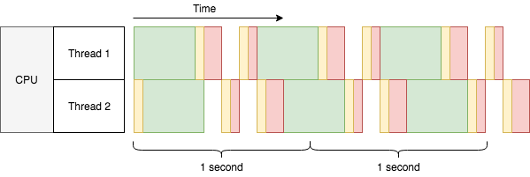

=====================
Why Asynchronous ORM?
=====================

Normally the answer is no, you don't need an asynchronous ORM. Before moving
on, you should read `this blog post
<http://techspot.zzzeek.org/2015/02/15/asynchronous-python-and-databases/>`_
from Mike Bayer, the author of SQLAlchemy. Though it was written before the
project uvloop_, but his points are still valid now:

1. Async is usually not essential for stereotypical database logic;
2. Async is **slower**, not faster, measured in single-routine.

Next, we'll roughly go through what is asynchronous I/O again, and its
pros/cons in practice, as well as when asynchronous ORM can be helpful.

The Story
---------

Let's say we want to build a search engine. We'll use a single core computer to
build our index. To make things simpler, our tasks are to fetch web pages
(I/O operation), and process their content (CPU operation). Each task looks
like this:

.. image:: why_single_task.png

We have lots of web pages to index, so we simply handle them one by one:

.. image:: why_throughput.png

We assume the time of each task is constant. Within 1 second, 2 tasks are done.
So we can say, the throughput of current system is 2 tasks/sec. How can we
improve the throughput? An obvious answer is to add more CPU cores:

.. image:: why_multicore.png

This simply doubles our throughput to 4 tasks/sec, and linearly scales as we
adding more CPU cores, if the network is not a bottleneck. But can we improve
the throughput for each CPU core? The answer is yes, we can use
multi-threading:

Wait a second here, 2 threads barely finished 6 tasks in 2 seconds, the
throughput is only 2.7 tasks/sec, much lower than 4 tasks/sec with 2 cores.
What's wrong with multi-threading? From the diagram we can see:

* There are yellow bars taking up extra time.
* The green bars can still overlap with any bar in the other thread, but
* non-green bars cannot overlap with non-green bars in the other thread.

The yellow bars are time taken by `context switches
<https://en.wikipedia.org/wiki/Context_switch>`_, a technique to allow multiple
threads or processes to run on a single CPU core concurrently. Because one CPU
core can do only one thing at a time (let's assume a world without
`Hyper-threading <https://en.wikipedia.org/wiki/Hyper-threading>`_ or something
like that), so in order to run several threads concurrently, the CPU must
`split its time <https://en.wikipedia.org/wiki/Time-sharing>`_ into small
slices, and run a little bit of each thread with these slices. The yellow bar
is the very cost for CPU to switch its context to run a different thread. The
scale is a bit dramatic, but it helps with the point.

Wait again here, the green bars are overlapping between threads, the CPU is
doing two things at the same time? No, the CPU is doing nothing in the middle
of the green bar, because it's waiting for the HTTP response (I/O). That's why
multi-threading could improve the throughput to 2.7, instead of making it
worse to 1.7 tasks/sec. You may try in real to run CPU-intensive tasks with
multi-threading on single core, there won't be any improvement. Like the
multiplexed red bars (in practice there might be more context switches
depending on the task), they seems to be running at the same time, but the
total time for all to finish is actually longer than running each of them one
by one. That's also why this is called concurrency instead of parallelism.

Foreseeably as adding more threads, the increase of throughput will slow down,
or even get decreasing, because context switches are wasting too much time,
not to mention the extra memory footprint taken by new threads. It is usually
not quite practical to have tens of thousands of threads running on a single
CPU core. But is it possible to have tens of thousands of I/O-bound tasks to
run concurrently on a single CPU core somehow? This is the once-famous `C10k
problem <https://en.wikipedia.org/wiki/C10k_problem>`_, usually solved by
asynchronous I/O:

.. image:: why_coroutine.png

.. note::

    Asynchronous I/O and coroutine are two different things, but they usually
    work together. Here we shall not follow too deep into the rabbit hole of
    low-level asynchronous I/O, and stay with coroutines for its simplicity.

Awesome! The throughput is 3.7 tasks/sec, almost as good as 4 tasks/sec of 2
CPU cores. Though this is not real data, comparing to OS threads, coroutines
do take much less context switch time and memory footprint, thus made it an
ideal option for the C10k problem.

Cooperative multitasking
------------------------

So what is coroutine?

In the last diagram above, you may have noticed one difference comparing to all
the other previous diagrams: the green bars are overlapping within the same
thread. That is because the last diagram is using asynchronous I/O, while the
rest are using blocking I/O. Like its naming, blocking I/O will block the
thread until the I/O result is ready, thus there can be only one blocking I/O
operation running in a thread. To achieve concurrency, blocking I/O has to go
for multi-threading or multi-processing. Oppositely, asynchronous I/O allows
thousands (or even more) of concurrent I/O reads and writes within the same
thread, each I/O operation only blocks one coroutine instead of the whole
thread. Like threads, coroutine here is a way to organize concurrency with
asynchronous I/O.

Threads are scheduled by the operating system in an approach called `preemptive
multitasking <https://en.wikipedia.org/wiki/Preemption_(computing)>`_. For
example in previous multi-threading diagram, there was only one CPU core. When
Thread 2 tried to start processing the first web page content, Thread 1 hadn't
finished processing its own. The OS brutally interrupted Thread 1 and shared
some resource (time) for Thread 2. But Thread 1 also needed CPU time to finish
its processing at the same time, so in turn after a while the OS had to pause
Thread 2 and resume Thread 1. Depending on the size of the task, such turns may
happen several times, so that every thread may have a fair chance to run. It is
something like this:

.. code-block:: none

    Thread 1: I wanna run!
    OS: Okay, here you go...
    Thread 2: I wanna run!
    OS: Urh, alright one sec ... Thread 1, hold on for a while!
    Thread 1: Well I'm not done yet, but you are the boss.
    OS: It won't be long. Thread 2 it's your turn now.
    Thread 2: Yay! (&%#$@..+*&#)
    Thread 1: Can I run now?
    OS: Just a moment please ... Thread 2, give it a break!
    Thread 2: Alright ... but I really need the CPU.
    OS: You'll have it later. Thread 1, hurry up!

Differently, coroutines are scheduled by themselves cooperatively with the help
of an event manager. The event manager lives in the same thread as the
coroutines, it is interestingly the opposite to the OS scheduler for threads:
while OS scheduler pauses threads, coroutines pauses themselves; thread knows
when it wants to run, but coroutines don't - only the event manager knows which
coroutine should run. The event manager may only trigger the next coroutine to
run, after the previous coroutine yields control to wait for an event (e.g.
wait for an HTTP response). This approach to achieve concurrency is called
`cooperative multitasking
<https://en.wikipedia.org/wiki/Cooperative_multitasking>`_. It's like this:

.. code-block:: none

    Coroutine 1: Let me know when event A arrives. I'm done here before that.
    Event manager: Okay. What about you, coroutine 2?
    Coroutine 2: Um I've got nothing to do here before event B.
    Event manager: Cool, I'll be watching.
    Event manager: (after a while) Hey coroutine 1, event A is here!
    Coroutine 1: Awesome! Let me see ... looks good, but I need event C now.
    Event manager: Very well. Seems event B arrived just now, coroutine 2?
    Coroutine 2: Oh wonderful! Let me store it in a file ... There! I'm all done.
    Event manager: Sweet! Since there's no sign of event C yet, I'll sleep for a while.
    (silence)
    Event manager: Damn, event C timed out!
    Coroutine 1: Arrrrh gotta kill myself with an exception :S
    Event manager: Up to you :/

For coroutines, a task cannot be paused externally, only the task itself could
pause from within. When there are a lot of coroutines, concurrency depends on
each of them shall pause from time to time to wait for events. If you wrote a
coroutine that never pauses, it allows no concurrency at all when running. On
the other hand, you should feel safe in the code between pauses, because no
other coroutines could run at the same time to mess up shared states. That's
why in previous last diagram, the red bars are not interlaced like threads.

.. tip::

    In Python and asyncio, ``async def`` declares coroutines, ``await`` yields
    control to event loop (event manager).

Pros and cons
-------------

Asynchronous I/O may handle tens of thousands of concurrent I/O operations in
the same thread. This may save a lot of time from context switching, and memory
from multi-threading. Therefore if you are dealing with lots of I/O-bound tasks
concurrently, asynchronous I/O could efficiently use limited CPU and memory to
deliver greater throughput.

With coroutines, you can naturally write sequential code that is cooperatively
scheduled. If your business logic is complex, coroutines could greatly improve
readability of asynchronous I/O code.

However for single task, asynchronous I/O is actually making it slower. For a
simple ``recv()`` operation for example, blocking I/O would just block and
return result, but it needs quite some steps in asynchronous I/O: register for
the read event, wait until event arrives, try to ``recv()``, repeat until
result returns, feed the result to a callback at last. With coroutines, the
framework cost is even larger. Thanks to uvloop_ this cost has been minimized
in Python, still it is overhead comparing to raw blocking I/O.

And, asynchronous I/O is unpredictable in time, because of its cooperative
nature. For example, in a coroutine you want to sleep for 1 second. But another
coroutine took the control and ran for 2 seconds. When we get back to the
former coroutine, it is already 2 seconds later. Therefore, ``sleep(1)`` means
to wait for at least 1 second. In practice, you should try your best to make
sure that all code between ``await`` should finish ASAP, being literally
cooperative. Still, there can be code beyond control, so it is important to
keep the uncertainty in mind all the time.

At last, asynchronous programming is complicated, it's easier said than done.
Debugging is a tough job too. Especially when a whole team is working on the
same piece of asynchronous code, it could easily go wrong. Therefore, a general
suggestion is, use asynchronous I/O carefully for I/O-bound high concurrency
scenarios only. It's not a drop-in replacement for performance boost, but more
like a sharp blade for concurrency with two edges. And if you are dealing with
deadline-intensive tasks, think again to be sure.

About Database and ORM
----------------------

Finally, GINO. We assume a scenario that asynchronous I/O is anyway required
for the server itself, regardless of how we handle database.

Now that we know asynchronous I/O is for I/O intensive tasks. But isn't it I/O
intensive to frequently talk to a remote database? It depends. Like Mike said,
"intensive" is relative to your actual code. Modern databases are super fast
and reliable, network is reliable if put in LAN, therefore if actual database
access time is of the minority of the program, it is not I/O intensive. Using
asynchronous I/O for database in this case could not improve throughput much,
or even make it worse due to asynchronous framework overhead as we mentioned.
It looks easier to just use blocking database operations in your coroutines
instead without harming performance.

But there is a high risk to cause dead locks. For example, the first coroutine
starts a transaction and updated a row, then the second coroutine tries to
update the same row before the first coroutine closes the transaction. The
second coroutine will block the whole thread at the non-async update, waiting
for the row lock to be released, but the releasing is in the first coroutine
which is blocked by the second coroutine. Thus it will block forever.

This may happen even if you optimized all database interactions to be as
quickly as possible. Racing condition just happens under pressure, and anything
that may block will eventually block. Therefore, don't call blocking methods in
coroutines, ever. (Unless you are 100% sure it won't cause a dead lock)

A simple fix would be to defer the database operations into threads, so that
they won't block the main thread, thus won't cause a dead lock easily. It
usually works and there is even a library to do so. However when it comes to
ORM, things become dirty.

Traditional ORMs are usually implicit for convenience, lazy property loading
for example. In a larger project, you never know which statement has a side
effect to make an implicit database call, and block the main thread. Since you
cannot put only the underlying database access into the thread pool (you need
to ``await`` on the deferred database call), you'll start putting pieces of
code into the thread pool. But coroutines run only in the main thread, your
code starts to fall apart. This is usually the time when I suggest to separate
the server into two parts: "normal blocking with ORM" and "asynchronous without
ORM".

Eventually this is where GINO can be useful: convenience of database
abstraction is wanted in a classic asynchronous context. And thanks to
asyncpg_, the asynchronous overhead is by far still buried in its incredible
performance boost.

.. _uvloop: https://github.com/MagicStack/uvloop
.. _asyncpg: https://github.com/MagicStack/asyncpg
